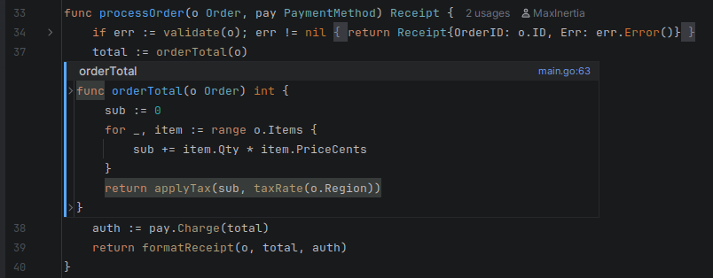
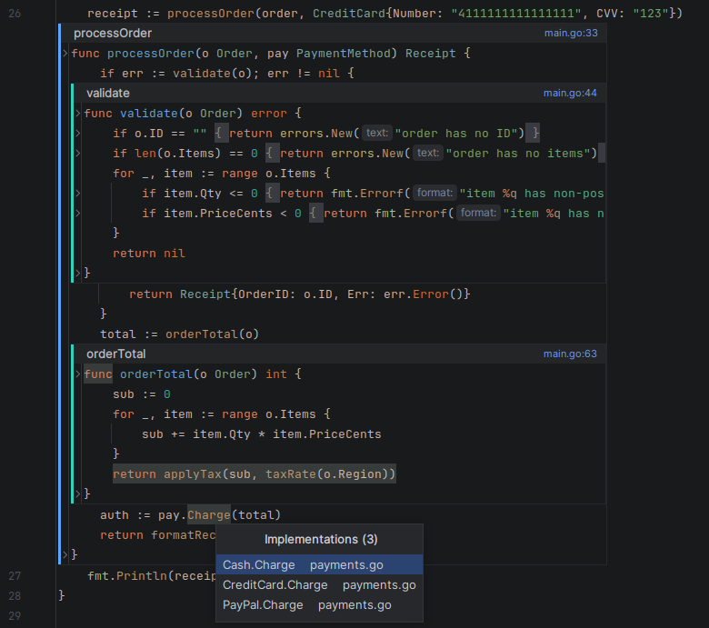
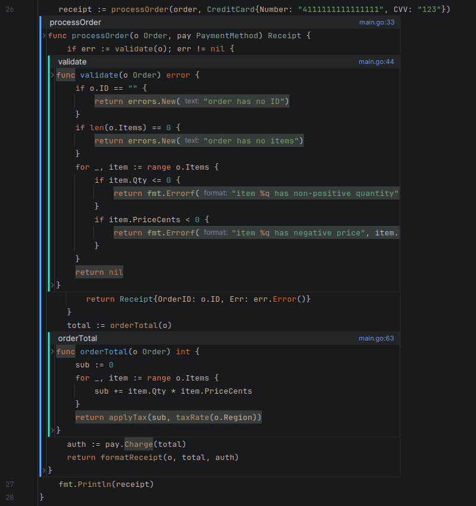

# goland-plugin

A GoLand/IntelliJ plugin (Kotlin + IntelliJ Platform Gradle Plugin 2.x) that
expands a **Go or TypeScript/JavaScript** call **inline in the editor** — put the
caret on a call and the callee's body is spliced in between the lines, rendered to
look and behave like the surrounding code.

See [`PLAN.md`](./PLAN.md) for the phased design and the rendering deep-dive, and
[`scaffold-notes.md`](./scaffold-notes.md) for current status and what's wired.

## Screenshots

A single inline expansion — `orderTotal` spliced in below the call as a
read-only native-editor frame (semantic colors, folding, go-to-def all intact):



Nested frames — `validate` and `orderTotal` expanded *inside* `processOrder`,
each a deeper rail color — with the implementation picker for the `pay.Charge`
interface call:



In-frame code folding — the gutter fold arrows work inside each frame, and the
frame re-fits as blocks collapse:



The code in these shots is the sample under
[`examples/screenshots/`](./examples/screenshots) — see its README for which call
to expand for each.

## Build

From this directory:

```sh
cd ~/projects/unfold/goland-plugin
./gradlew buildPlugin
```

This produces the installable plugin zip at
`build/distributions/goland-plugin-<version>.zip`.

To launch a throwaway sandbox IDE with the plugin already loaded (best for
iterating):

```sh
./gradlew runIde
```

### Requirements & first-build notes

- **JDK 21** — `build.gradle.kts` sets `jvmToolchain(21)`. If Gradle can't find a
  21 toolchain, install one (`sudo apt install openjdk-21-jdk`); Gradle
  auto-detects installed JDKs.
- **First build downloads its own GoLand** (`goland("2025.3.1.1")` in
  `build.gradle.kts`) to compile against the Go PSI and the bundled JavaScript/
  TypeScript PSI APIs — ~1 GB, cached under `~/.gradle` and `.intellijPlatform`.
  This is independent of any GoLand you have installed locally. First run is slow;
  later runs are fast.
- The build targets IDE build `253` (2025.3) with `untilBuild = "299.*"`, so the
  zip installs into newer GoLand releases too. To make `runIde` launch a
  different GoLand, change the `goland("...")` coordinate.

## Install the built zip

In GoLand: **Settings → Plugins → ⚙ → Install Plugin from Disk…** and pick the
zip from `build/distributions/`.

## Use it

Open a Go or TypeScript/JavaScript file, put the caret on a call:

- **Ctrl+Alt+W** — expand the call under the caret (again to collapse). Also on
  the editor right-click menu.
- **Ctrl+Alt+PgDn / PgUp** — focus into the expanded frame / back to the call site.
- **Ctrl+Alt+Backspace** — collapse the frame the caret is inside.

Expanded code is rendered as a real embedded editor over the callee file, so it
keeps native semantic colors, hover/quick-doc, go-to-definition, and folding.
